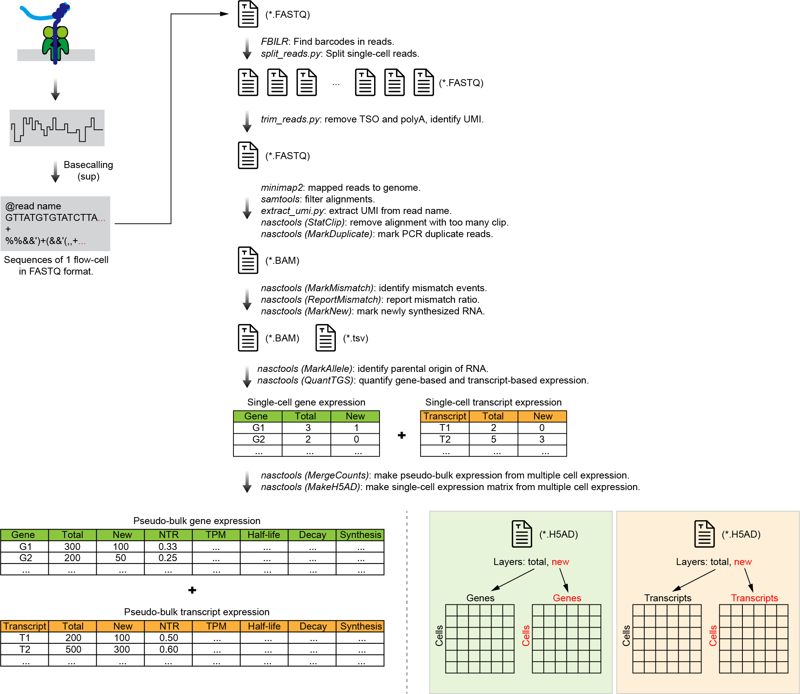

# Pipeline of NanoNASC-seq

This pipeline is designed for NanoNASC-seq data processing, from raw sequencing data (FASTQ) to expression matrix (H5AD). Please refer to the `Snakemake` file. 

## 1. Preparation

### Sequencing data (FASTQ)

Before starting the pipeline, we need to prepare three files (`20220729_K562_1.fastq.gz`, `20220729_K562_1.tsv`, and `20220729_K562_1.fa`), among which the `20220729_K562_1.fsatq.gz` file is downloaded from SRA, as shown below:

    # Download fastq from SRA.
    cd data
    prefetch -o ./SRR35386206.sra SRR35386206
    fasterq-dump -O ./ ./SRR35386206.sra
    pigz -p 8 -c ./SRR35386206.fastq
    mv SRR35386206.fastq.gz 20220729_K562_1.fastq.gz

The `20220729_K562_1.fa` file is in FASTA format and contains all barcode sequences in the barcode whitelist (partial of `nanopore_96_barcodes.fa`). The content is as follows:

    $ head 20220729_K562_1.fa
    >Bar1
    AAGAAAGTTGTCGGTGTCTTTGTG
    >Bar2
    TCGATTCCGTTTGTAGTCGTCTGT
    >Bar4
    TTCGGATTCTATCGTGTTTCCCTA
    >Bar5
    CTTGTCCAGGGTTTGTGTAACCTT
    >Bar6
    TTCTCGCAAAGGCAGAAAGTAGTC

The `20220729_K562_1.tsv` file is a tab-delimited text file. Each line represents a cell and contains two columns. The first column is the cell name and the second column is the barcode name. The content is as follows:

    $ head 20220729_K562_1.tsv
    20220729_K562_1.C01.K562_s4U_0uM_180min	Bar1
    20220729_K562_1.C02.K562_s4U_0uM_180min	Bar2
    20220729_K562_1.C03.K562_s4U_0uM_180min	Bar4
    20220729_K562_1.C04.K562_s4U_0uM_180min	Bar5
    20220729_K562_1.C05.K562_s4U_0uM_180min	Bar6
    20220729_K562_1.C06.K562_s4U_0uM_180min	Bar8
    20220729_K562_1.C07.K562_s4U_0uM_180min	Bar9
    20220729_K562_1.C08.K562_s4U_0uM_180min	Bar10
    20220729_K562_1.C09.K562_s4U_0uM_180min	Bar11
    20220729_K562_1.C10.K562_s4U_0uM_180min	Bar12

### Reference genome (FASTA) and gene (GTF)

Next, we need to obtain the reference genome and gene annotations. Here, we obtain them from GENCODE. The download process is as follows:

    # Download genome (FASTA) and gene annotation (GTF) from GENCODE (https://www.gencodegenes.org/).
    mkdir -p data/reference && cd data/reference
    wget https://ftp.ebi.ac.uk/pub/databases/gencode/Gencode_human/release_39/GRCh38.primary_assembly.genome.fa.gz
    wget https://ftp.ebi.ac.uk/pub/databases/gencode/Gencode_human/release_39/gencode.v39.annotation.gtf.gz

Only retain the chromosome sequence (chr1-22, chrX, chrY, and chrM) in the reference genome:

    gzip -d -c GRCh38.primary_assembly.genome.fa.gz > GRCh38.primary_assembly.genome.fa
    samtools faidx GRCh38.primary_assembly.genome.fa
    samtools faidx GRCh38.primary_assembly.genome.fa chr1 chr2 chr3 chr4 chr5 chr6 chr7 chr8 chr9 chr10 chr11 chr12 chr13 chr14 chr15 chr16 chr17 chr18 chr19 chr20 chr21 chr22 chrX chrY chrM > GRCh38.canonical.genome.fa
    samtools faidx GRCh38.canonical.genome.fa

Sorting the GTF records and build index for randomly access. Fetch the information from GTF file, including gene informatio (CSV format), transcript information (CSV format), gene structure (BED format) and transcript structure (BED format). `fetch_information_from_gtf.py` is from `pyBioInfo` package.

    gzip -d -c gencode.v39.annotation.gtf.gz | grep -v '^#' | sort -k1,1 -k4,4n -k5,5n > gencode.v39.annotation.sorted.gtf
    bgzip -c gencode.v39.annotation.sorted.gtf > gencode.v39.annotation.sorted.gtf.gz
    tabix -p gff gencode.v39.annotation.sorted.gtf.gz
    fetch_information_from_gtf.py gencode.v39.annotation.sorted.gtf.gz gencode.v39
    gzip -d -c gencode.v39.transcripts.bed.gz > gencode.v39.transcripts.bed

Build the minimap2 index in advance for fast genome mapping.

    # Build minimap2 index
    minimap2 -t 20 -x splice -d GRCh38.canonical.mm2.splice.mmi GRCh38.canonical.genome.fa

### SNPs database (BED)

We downloaded the SNPs annotation from UCSC.

    # SNPs databases
    wget https://hgdownload.soe.ucsc.edu/goldenPath/hg38/database/snp151.txt.gz
    gzip -dc snp151.txt.gz | awk -v FS='\t' -v OFS='\t' '{if($12=="single"){print $2,$3,$4}}' | awk '$3-$2==1' | bgzip -c > snp151.3.lite.bed.gz
    tabix -p bed snp151.3.lite.bed.gz

## 2. Demultiplexing single-cell reads

The sequencing data contains reads from multiple cells, which are tagged by cell barcodes. We first use FBILR to find barcodes in the long reads:

    fbilr -t 24 -r 10000 -m PE -b data/20220729_K562_1.fa data/20220729_K562_1.fastq.gz \
        | gzip -c > results/1_fbilr/20220729_K562_1.tsv.gz

Next, we split the fastq file into multiple fastq files based on the identified barcode, each fastq file represents a single cell. This process will remove barcode and outer sequences.

    ./scripts/split_reads.py data/20220729_K562_1.fastq.gz \
        results/1_fbilr/20220729_K562_1.tsv.gz \
        data/20220729_K562_1.tsv \
        results/2_splitted/20220729_K562_1
    pigz -p 12 results/2_splitted/20220729_K562_1/*/*.fastq

Next, trimming the single-cell long reads. This process will remove TSO sequences, identify polyA sequence, remove polyA sequence, correct direction, extract UMI sequence.

    ./scripts/trim_reads.py \
        results/2_splitted/20220729_K562_1/succeed/20220729_K562_1.C01.K562_s4U_0uM_180min.fastq.gz \
        results/3_trimmed/20220729_K562_1/20220729_K562_1.C01.K562_s4U_0uM_180min
    gzip results/3_trimmed/20220729_K562_1/20220729_K562_1.C01.K562_s4U_0uM_180min/trimmed.fastq

## 3. Genome mapping

Next, mapping the single-cell long reads to the reference genome by using Minimap2.

    minimap2 -ax splice -u f -Y --MD -t 12 \
        -R '@RG\tID:20220729_K562_1.C01.K562_s4U_0uM_180min\tLB:20220729_K562_1.C01.K562_s4U_0uM_180min\tSM:20220729_K562_1.C01.K562_s4U_0uM_180min' \
        --junc-bed data/reference/gencode.v39.transcripts.bed \
        data/reference/GRCh38.canonical.mm2.splice.mmi \
        results/3_trimmed/20220729_K562_1/20220729_K562_1.C01.K562_s4U_0uM_180min/trimmed.fastq.gz \
        | samtools view -@ 4 -u - \
        | samtools sort -@ 4 \
            -T results/4_minimap2/20220729_K562_1/20220729_K562_1.C01.K562_s4U_0uM_180min.bam \
            -o results/4_minimap2/20220729_K562_1/20220729_K562_1.C01.K562_s4U_0uM_180min.bam - 
    samtools index -@ 4 results/4_minimap2/20220729_K562_1/20220729_K562_1.C01.K562_s4U_0uM_180min.bam
    samtools flagstat -@ 4 results/4_minimap2/20220729_K562_1/20220729_K562_1.C01.K562_s4U_0uM_180min.bam \
        > results/4_minimap2/20220729_K562_1/20220729_K562_1.C01.K562_s4U_0uM_180min.flagstat

Next, filtering the alignments by chromosome, mapping quality and length.

    samtools view -@ 4 --expr 'rname =~ "^chr([0-9]+|[XY])$"' -q 30 -m 200 -F 2308 \
        -o results/5_filtered/20220729_K562_1/20220729_K562_1.C01.K562_s4U_0uM_180min.bam \
        results/4_minimap2/20220729_K562_1/20220729_K562_1.C01.K562_s4U_0uM_180min.bam
    samtools index -@ 4 results/5_filtered/20220729_K562_1/20220729_K562_1.C01.K562_s4U_0uM_180min.bam
    samtools flagstat -@ 4 results/5_filtered/20220729_K562_1/20220729_K562_1.C01.K562_s4U_0uM_180min.bam \
        > results/5_filtered/20220729_K562_1/20220729_K562_1.C01.K562_s4U_0uM_180min.flagstat

Next, extracting the UMI sequence from the read name and add it to the UM tag of the alignments

    ./scripts/extract_umi.py \
        results/5_filtered/20220729_K562_1/20220729_K562_1.C01.K562_s4U_0uM_180min.bam \
        results/6_extract_umi/20220729_K562_1/20220729_K562_1.C01.K562_s4U_0uM_180min.bam
    samtools index -@ 4 results/6_extract_umi/20220729_K562_1/20220729_K562_1.C01.K562_s4U_0uM_180min.bam

Next, filtering out reads with more than 20 nt of soft-clip at both ends of the read.

    nasctools StatClip -c 20 \
        -s results/7_stat_clip/20220729_K562_1/20220729_K562_1.C01.K562_s4U_0uM_180min.tsv \
        -i results/6_extract_umi/20220729_K562_1/20220729_K562_1.C01.K562_s4U_0uM_180min.bam \
        -o results/7_stat_clip/20220729_K562_1/20220729_K562_1.C01.K562_s4U_0uM_180min.bam
    samtools index -@ 4 results/7_stat_clip/20220729_K562_1/20220729_K562_1.C01.K562_s4U_0uM_180min.bam
    samtools flagstat -@ 4 results/7_stat_clip/20220729_K562_1/20220729_K562_1.C01.K562_s4U_0uM_180min.bam \
        > results/7_stat_clip/20220729_K562_1/20220729_K562_1.C01.K562_s4U_0uM_180min.flagstat

Next, marking the PCR duplication reads.

    nasctools MarkDuplicate \
        -s results/8_mark_duplicate/20220729_K562_1/20220729_K562_1.C01.K562_s4U_0uM_180min.tsv \
        -i results/7_stat_clip/20220729_K562_1/20220729_K562_1.C01.K562_s4U_0uM_180min.bam \
        -o results/8_mark_duplicate/20220729_K562_1/20220729_K562_1.C01.K562_s4U_0uM_180min.bam
    samtools index results/8_mark_duplicate/20220729_K562_1/20220729_K562_1.C01.K562_s4U_0uM_180min.bam
    samtools flagstat results/8_mark_duplicate/20220729_K562_1/20220729_K562_1.C01.K562_s4U_0uM_180min.bam \
        > results/8_mark_duplicate/20220729_K562_1/20220729_K562_1.C01.K562_s4U_0uM_180min.flagstat
    

## 4. Identify mismatch events

Identify mismatch events in reads and save them in the ME tag. After excluding SNP-mediated mismatch events, save them in the CE tag. Save mismatch events corrected by PCR reads in the HE tag.

    nasctools MarkEvent -c -t 4 \
        -f data/reference/GRCh38.canonical.genome.fa \
        -s data/snp151.3.lite.bed.gz \
        -i results/8_mark_duplicate/20220729_K562_1/20220729_K562_1.C01.K562_s4U_0uM_180min.bam \
        -o results/10_marked_events/20220729_K562_1/20220729_K562_1.C01.K562_s4U_0uM_180min.bam
    samtools index -@ 4 results/10_marked_events/20220729_K562_1/20220729_K562_1.C01.K562_s4U_0uM_180min.bam

Report the mismatch ratio:

    nasctools ReportMismatch -t 4 \
        -i results/10_marked_events/20220729_K562_1/20220729_K562_1.C01.K562_s4U_0uM_180min.bam \
        -o results/11_ratio_all/20220729_K562_1/20220729_K562_1.C01.K562_s4U_0uM_180min.tsv

Report the mismatch ratio (excluded PCR duplicate reads):

    nasctools ReportMismatch -t 4 --discard-duplicates \
        -i results/10_marked_events/20220729_K562_1/20220729_K562_1.C01.K562_s4U_0uM_180min.bam \
        -o results/12_ratio_rmdup/20220729_K562_1/20220729_K562_1.C01.K562_s4U_0uM_180min.tsv

Report the corrected mismatch ratio:

    nasctools ReportMismatch --event-tag HE --reads 2 --discard-duplicates \
        -t 4 \
        -i results/10_marked_events/20220729_K562_1/20220729_K562_1.C01.K562_s4U_0uM_180min.bam \
        -o results/13_ratio_corrected/20220729_K562_1/20220729_K562_1.C01.K562_s4U_0uM_180min.tsv

Marking the new RNA by corrected mismatch events (T-C >= 2):

    nasctools MarkNew --event-tag HE --tc 2 --quality 0 \
        -i results/10_marked_events/20220729_K562_1/20220729_K562_1.C01.K562_s4U_0uM_180min.bam \
        -o results/14_marked_new/20220729_K562_1/20220729_K562_1.C01.K562_s4U_0uM_180min.bam
    samtools index results/14_marked_new/20220729_K562_1/20220729_K562_1.C01.K562_s4U_0uM_180min.bam

## 5. Measurement of expression

Quantification of genes and transcripts:

    nasctools QuantTGS -s 2 -c 2 \
        -t data/reference/gencode.v39.transcripts.rich_name.bed.gz \
        -i results/14_marked_new/20220729_K562_1/20220729_K562_1.C01.K562_s4U_0uM_180min.bam \
        -o results/15_quant_tgs/20220729_K562_1/20220729_K562_1.C01.K562_s4U_0uM_180min

Calculate the pseudo-bulk expression level:

    # gene-based
    ls -1 results/15_quant_tgs/*/*/quant_gene.tsv > results/16_pseudobulk/K562.gene_based.filelist.txt
    nasctools MergeCounts -l results/16_pseudobulk/K562.gene_based.filelist.txt -a data/reference/gencode.v39.gene_info.csv -o results/16_pseudobulk/K562.gene_based.csv

    # transcript-based
    ls -1 results/15_quant_tgs/*/*/quant_transcript.tsv > results/16_pseudobulk/K562.transcript_based.filelist.txt
    nasctools MergeCounts -l results/16_pseudobulk/K562.transcript_based.filelist.txt -a data/reference/gencode.v39.transcript_info.csv -o results/16_pseudobulk/K562.transcript_based.csv

    # gene-based (treatment cell only)
    ls -1 results/15_quant_tgs/*/*s4U_50uM_180min*/quant_gene.tsv > results/16_pseudobulk/K562.s4U_50uM_180min.gene_based.filelist.txt
    nasctools MergeCounts -l results/16_pseudobulk/K562.s4U_50uM_180min.gene_based.filelist.txt -a data/reference/gencode.v39.gene_info.csv -o results/16_pseudobulk/K562.s4U_50uM_180min.gene_based.csv

    # transcript-based (treatment cell only)
    ls -1 results/15_quant_tgs/*/*s4U_50uM_180min*/quant_transcript.tsv > results/16_pseudobulk/K562.s4U_50uM_180min.transcript_based.filelist.txt
    nasctools MergeCounts -l results/16_pseudobulk/K562.s4U_50uM_180min.transcript_based.filelist.txt -a data/reference/gencode.v39.transcript_info.csv -o results/16_pseudobulk/K562.s4U_50uM_180min.transcript_based.csv

Make expression matrix (H5AD):

    # gene-based
    ls -1 results/15_quant_tgs/*/*/quant_gene.tsv | awk '{split($1,a,"/");print a[4]","$1}' > results/17_h5ad/K562.gene_based.filelist.csv
    nasctools MakeH5AD -b gene -g data/reference/gencode.v39.gene_info.csv -f results/17_h5ad/K562.gene_based.filelist.csv -o results/17_h5ad/K562

    # transcript-based
    ls -1 results/15_quant_tgs/*/*/quant_transcript.tsv | awk '{split($1,a,"/");print a[4]","$1}' > results/17_h5ad/K562.transcript_based.filelist.csv
    nasctools MakeH5AD -b gene -g data/reference/gencode.v39.transcript_info.csv -f results/17_h5ad/K562.transcript_based.filelist.csv -o results/17_h5ad/K562

## Dependencies

    sratools (3.1.0)
    minimap2 (2.26)
    samtools (1.19.2)
    pyBioInfo (1.0.0) (https://github.com/Ckenen/pyBioInfo)
    FBILR (v1.0.0) (https://github.com/Ckenen/fbilr)
    nasctools (1.0.0) (https://github.com/Ckenen/nasctools)

## Contact

If you have any question please write issue for this repository or contact me directly at <chenzonggui@stu.pku.edu.cn>.
